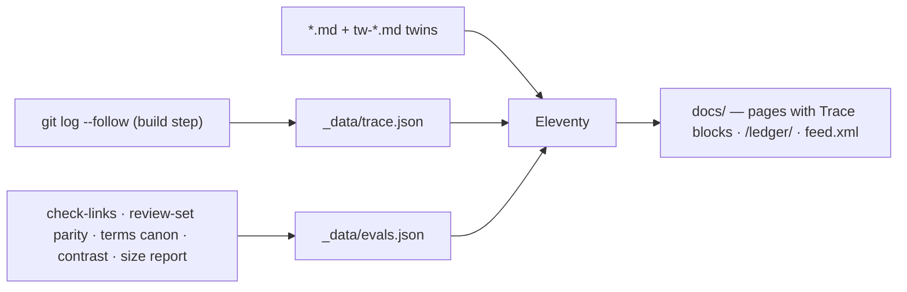

# civic.ai — Design Charter

This document is the design north star for **civic.ai**. It binds visual language, interaction, and information architecture. It is deliberately not bound by the current build: where the two disagree, this charter wins and the build catches up. Build mechanics stay in [AGENTS.md](AGENTS.md); content conventions stay in [README.md](README.md).

The charter's test for every element on every page is the book's own test for a pack name: **if it does not change who can object, who must answer, what gets logged, or what happens after failure, it is decoration.**

---

## 1. North star

> The site is the first exhibit. It must be governed the way it asks AI to be governed.

civic.ai argues that legitimacy comes from institutions that show their work, answer to the people they affect, repair in public, and stay sunset-ready. Nearly every site on the internet — including most sites about AI ethics — fails that test. This one must pass it, visibly.

So the design brief is not "make a beautiful book site." It is: **make the first website that runs its own 6-Pack of Care, and let every aesthetic choice fall out of that.** The beauty is a consequence of the honesty, the way a well-kept ledger or a well-worn tool is beautiful.

Three phrases from the project's own vocabulary anchor everything below:

- **"Governance should feel like a daily capability"** → the palette and pack colours follow a day cycle, ending at sunset.
- **"Many local guardians rather than one central watchtower"** → the identity mark is a ring of small lights with an empty centre.
- **"Data is soil, not oil"** → the material world of the design is soil, field, moss, harvest, cinnabar seal — not chrome, gradients, or "tech."

## 2. Who it serves

| Audience                        | Their job here                                  | Design consequence                                                        |
| ------------------------------- | ----------------------------------------------- | ------------------------------------------------------------------------- |
| Policy & governance people      | Cite it, brief a minister, draft a clause       | Paragraph-numbered public-record pages; print that survives a photocopier |
| Builders & engineers            | Implement a pack; run a Kami                    | Instrument-grade Measures; copyable terminal blocks; the machine door     |
| Civic & community practitioners | Convince a room; run a process                  | Comics, audio, plain-language "gist" cards, reading paths                 |
| Carers and older readers        | Read comfortably; feel respected                | 18 px+ body type, high contrast, obvious controls, no tricks              |
| Mandarin readers (zh-Hant)      | A first-class edition, not a translation ghetto | Twin pages with equal typographic dignity; Han-first display type         |
| AI agents ("claws")             | Bootstrap as a Kami; quote faithfully           | OpenClaw well-known surface, llms.txt, JSON-LD, stable anchors            |

Two scripts, one design. The zh-Hant edition is never a re-skin of the English page; both are twins of one underlying record.

## 3. The argument, restated as design

Each pack becomes a standing behaviour of the site itself. This table is the charter's spine; every section that follows implements a row of it.

| Pack                     | The site's obligation                                                                                                                 | Mechanism                                                                                             |
| ------------------------ | ------------------------------------------------------------------------------------------------------------------------------------- | ----------------------------------------------------------------------------------------------------- |
| 1・Attentiveness 覺察力  | Every page listens. Disagreement has a door on every page, and missing voices are invited, not just tolerated.                        | "Contest this page" route in the Trace; bilingual door in the masthead; a11y as listening             |
| 2・Responsibility 負責力 | Every page is signed. Named stewards, named illustrator, named contributors — a human answers for every claim.                        | The seal and steward line in the Trace; commit-log authorship surfaced, not buried                    |
| 3・Competence 勝任力     | The site publishes its own evals. The checks that already run in private (links, parity, terminology, contrast) become public.        | The eval board in the Trace, fed by build-time checks; failures shown amber, never hidden             |
| 4・Responsiveness 回應力 | Every page shows its amendment history and what changed after someone objected.                                                       | Per-page amendment count + ledger link, derived from git; the/ledger/page                             |
| 5・Solidarity 團結力     | Nothing locks anyone in. CC0, self-hosted fonts, no third-party calls, readable without JavaScript, exportable, syndicated.           | Weight budget; refusals list; RSS; print styles; plain-HTML floor                                     |
| 6・Symbiosis 共生力      | The site stays bounded and sunset-ready. No engagement mechanics, no growth loops, and an honest handover plan when its work is done. | Refusals list; colophon statement of scope and succession; the machine door for symbiosis with agents |

This is the "insanely great" move: no other site can copy it without also adopting the ethics. The design cannot be stolen as a skin.

## 4. Identity

### 4.1 Name

The wordmark is bilingual and equal: **civic.ai・仁工智慧**. On EN pages English leads; on zh pages 仁工智慧 leads. Neither is a subtitle of the other.

### 4.2 The Ring of Six

The identity mark is six small round lights arranged in a ring **with an empty centre**. The centre is the room where the community sits; no system occupies it. This is the thesis drawn in six dots — many local guardians, no central watchtower.

- Geometry: six circles on a hexagonal ring; centre void ≥ 1.6× the dot diameter.
- Each dot may carry its pack hue (§5.3) in wayfinding contexts; elsewhere the ring is monochrome ink.
- The favicon is the ring. The dot in the wordmark "civic.ai" is the ring at small size.
- In Lantern mode (§13) the dots glow faintly; in print they are outlines.

### 4.3 The seal

A square cinnabar chop of **仁** in seal script (an SVG, not a font) is the site's signature. It appears in exactly one place per page — the Trace (§8) — the way a chop lands once on a document. It never decorates. Red used anywhere else must justify itself against §5.4.

### 4.4 Partner marks

Oxford Institute for Ethics in AI and Accelerator Fellowship Programme marks are treated by page role. **The home/index page keeps the current Oxford-blue institutional masthead**: it is the doorway from the AFP world into civic.ai, and the original reversed lockups are correct there. Every other page moves those marks to a quiet **colophon band** directly above the footer: small, monochrome, dignified — the way a university press signs a book's spine rather than its every page. **Asset rule:** the shipped `oxford-logo.svg`/`afp-logo.svg` are reversed (white on navy) lockups for the current header; the colophon on `--field` paper needs dedicated light-background variants (ink/soil fills, mark without teal–blue gradient) or an approved mono set from the institutions — CSS filters cannot invert them. If institutional agreements require header presence beyond the home page, the interior masthead carries a single-line text credit instead of logo images.

## 5. Colour — "Soil & Daylight"

### 5.1 Intent

The palette comes from the project's own materials: field soil, rice paper, moss, harvest grain, seal paste. It is explicitly **not** the AI-default cream-and-terracotta editorial palette: the ground is cast toward green-grey (field light), never yellow-pink (latte); the red is a functional seal, never an accent sprinkled on headings; and gold appears only as harvest-marks on glossed terms.

### 5.2 Core tokens (Daylight theme)

| Token        | Name        | Hex       | Role                                                                        |
| ------------ | ----------- | --------- | --------------------------------------------------------------------------- |
| `--field`    | 田 Field    | `#F2F1E8` | Page ground — warm paper with a green-grey cast                             |
| `--surface`  | 紙 Paper    | `#FBFAF4` | Raised cards, gist blocks                                                   |
| `--ink`      | 墨 Ink      | `#211D16` | Primary text — warm soil-black, not asphalt                                 |
| `--soil`     | 壤 Soil     | `#5A5142` | Secondary text, captions                                                    |
| `--moss`     | 苔 Moss     | `#33603E` | Links and interactive affordances (always underlined)                       |
| `--cinnabar` | 硃 Cinnabar | `#B4351F` | The seal, contest actions, failing evals — functional red only              |
| `--harvest`  | 穗 Harvest  | `#96762F` | Glossary gloss marks, fine highlights                                       |
| `--rule`     | 界 Boundary | `#DDD9CB` | Hairlines in machinery zones                                                |
| `--oxford`   | 紋 Oxford   | `#002147` | Institutional provenance — home masthead, interior frame rules, formal CTAs |

All text/ground pairs must clear WCAG 2.2 AA; the exact values above are starting points, tuned under the automated contrast eval (§3, Pack 3) rather than by eye alone.

### 5.3 The six pack hues — a day cycle

"Governance as a daily capability" becomes literal: packs 1–4 (the care cycle) run dawn → afternoon; pack 5 is dusk, when lights come on together; pack 6 is sunset — the pack that is _about_ being sunset-ready. Then the cycle returns to dawn.

| Pack | Hue name          | Hex       | Sense                              |
| ---- | ----------------- | --------- | ---------------------------------- |
| 1    | 曉 First light    | `#B0803C` | Noticing begins the day            |
| 2    | 朝 Morning brick  | `#96482B` | Taking up the work; who answers    |
| 3    | 午 Noon field     | `#4F6B33` | The work itself, done well         |
| 4    | 霖 Afternoon rain | `#2E6763` | Repair after weather               |
| 5    | 暮 Dusk market    | `#3F4E82` | Lights coming on together          |
| 6    | 落 Sunset         | `#77465F` | Bounded, plural, ready to end well |

Usage is strict duotone: a pack hue may tint its page's eyebrow label, its compass segment, and pull-quote rules — never body text, never backgrounds behind prose, never the page frame. **Oxford blue is not retired; it is constrained.** It appears when the site is explicitly speaking from its institutional home: the index masthead, matching interior masthead/colophon frame rules, formal provenance links, and at most one primary institutional CTA. Pages stay one family; hue is wayfinding, Oxford blue is provenance, neither becomes a theme.

### 5.4 Rules

- Cinnabar appears at most twice per viewport: the seal, and one action that genuinely contests or warns. Zero is common.
- No gradients. Light in this design comes from paper and (in Lantern mode) from glow, never from a `linear-gradient` sky.
- No pure black, no pure white anywhere.
- The AFP teal→blue gradient is allowed only inside the official reversed masthead lockup on the home page. It is not a site accent and does not appear in interior chrome.

## 6. Type — "Two Voices"

### 6.1 Intent

The book's thesis is a pairing: human deliberation plus inspectable machinery. The typography encodes exactly that, and nothing else:

- **The human voice** — everything argued, narrated, or spoken — is set in serif.
- **The machinery voice** — everything logged, measured, checked, or executable — is set in mono, and never lies about being machinery.

There is no third voice. UI chrome (nav, labels, buttons) borrows the machinery voice at small sizes, because navigation is honest plumbing.

### 6.2 Faces

| Role                     | Latin                        | Han (zh-Hant)                           | Notes                                                                                                       |
| ------------------------ | ---------------------------- | --------------------------------------- | ----------------------------------------------------------------------------------------------------------- |
| Display & prose          | **Literata** (variable, OFL) | **Noto Serif TC** (subset per page)     | Bookish, built for long reading, optical sizes; Ming-serif stroke logic pairs with Literata's calm contrast |
| Machinery                | **IBM Plex Mono**            | **Noto Sans TC** (small sizes)          | Tabular figures mandatory (`font-variant-numeric: tabular-nums`)                                            |
| Tibetan (Monlam AI case) | —                            | **Monlam Bodyig** (already self-hosted) | Keep; it is a solidarity statement in font form                                                             |

**jf 蘭陽明體 (LanYang Ming) is image-only.** There is no web-embedding licence, and none is coming: it must never ship as a webfont, a subset, or outlined SVG text. Where its voice is wanted — the bilingual wordmark lockup, title plates inside illustrations — it is pre-rendered offline into PNG, the same workflow already used for illustration, with the full text carried in `alt`. Live DOM text in zh-Hant is always Noto Serif TC; it is the shipped face, not a placeholder.

All fonts self-hosted, subset, `woff2`, `font-display: swap`. No CDN fonts, ever (§3, Pack 5).

### 6.3 Scale and rhythm

- Root: 18 px minimum body (older readers are a named audience, §2). Modular scale ≈ 1.2 (minor third); h1 clamps `2rem → 3rem`.
- Measure: 66 ch English prose; 34–38 full-width characters for zh prose.
- Leading: EN body 1.65; zh body 1.95 (Han needs air); machinery 1.5.
- Headings: Literata 500–600, tight tracking; never all-caps in the human voice. Machinery labels may letterspace lowercase or use caps at ≤ 0.75 rem.

### 6.4 Bilingual mechanics

- Pangu spacing between Han and Latin/digits is enforced at build (existing `pangu-format.mjs`) — the design treats that spacing as kerning, not decoration.
- zh punctuation: full-width; hanging punctuation enabled where supported (`hanging-punctuation: first last`), quote 「」 styling per house rules; `——` set solid.
- Inline language switches carry `lang` attributes so the correct face and line-breaking apply per span (`text-autospace`/`word-break: keep-all` tuning for Han).
- The EN⇄zh toggle is a **twin-page ritual**, not a flag icon: the control names the twin ("華文・同一頁" on EN pages; "English・same page" on zh pages) and preserves reading position — anchor-mapped where headings correspond, scroll-fraction fallback otherwise.

## 7. Space & structure

### 7.1 Page anatomy

One anatomy serves every page; blueprints (§10) vary the organs, not the skeleton.

```
┌──────────────────────────────────────────────────────────────┐
│ masthead   civic.ai · 仁工智慧      ◦◦◦◦◦◦ compass   華文 ⇄ │  ← quiet bar, sticky-less
├────────────────Oxford-blue provenance rule (2px)─────────────┤
│                                                              │
│   eyebrow  PACK 4 · 回應力 · AFTERNOON RAIN                  │
│   title    Responsiveness                                    │
│   gist     [In short — 2-sentence summary · 8 min read]      │
│                                                              │
│   ┌────────────────────────────┐  ┌──────────────┐           │
│   │ prose column (66ch)        │  │ margin rail  │           │
│   │                            │  │ ¶ anchors    │           │
│   │ ¶12 …text…                 │  │ glossary     │           │
│   │                            │  │ side-notes   │           │
│   │ [machinery block: full     │  │ trace chip   │           │
│   │  rules, mono, squared]     │  │              │           │
│   └────────────────────────────┘  └──────────────┘           │
│                                                              │
│   cycle nav   ← Pack 3 · Noon        Pack 5 · Dusk →         │
├──────────────────────────────────────────────────────────────┤
│ THE TRACE  (full-width machinery block, §8)                  │
├──────────────────────────────────────────────────────────────┤
│ colophon band  ·  Oxford marks  ·  footer                    │
└──────────────────────────────────────────────────────────────┘
```

- **Masthead**: interiors use one quiet line — wordmark, compass, twin-page toggle — held by a 2 px Oxford-blue provenance rule that matches the colophon rule below. No banner, no hero-blue slab. The current 200 px institutional header is retained **only on the home/index page** as the Oxford/AFP doorway; interior pages open with the reader's content.
- **Margin rail** (≥ 1200 px): glossary side-notes (§11.5), paragraph anchors, and a condensed trace chip live here, statute-style. Below 1200 px the rail's contents fold into popovers and the end-of-page Trace.
- **Prose zones** are soft: generous white, 4 px radii on cards, no boxes around paragraphs.
- **Machinery zones** are squared: 0 radius, hairline `--rule` borders, mono type. A reader can tell from across the room which parts of the page are argument and which are record.

### 7.2 Paragraph numbers

Core-record pages (manifesto, packs 1–6, measures, FAQ) carry gazette-style paragraph numbers: `¶ 14` in the margin rail, each a stable anchor (`#p14`). Policy people cite paragraphs; scholars deep-link them; agents quote them verifiably. Numbers are machinery voice, soil-coloured, invisible until hover on small screens.

## 8. The signature — The Trace 記

One place gets all the boldness. Every page ends in a full-width machinery block: the page's public record. Nothing on the site is more memorable than this, by design.

```
────────────────────────────────────────────────── 記 · THE TRACE ──
 STEWARDS   Audrey Tang · Caroline Green                      ┌────┐
            with jdd-kami · Tenzin Yangtso                    │ 仁 │
 AMENDED    3 Jul 2026 · 214 amendments since Mar 2026        └────┘
            → full ledger  /ledger/
 SOURCE     1.md · CC0 public domain · edit on GitHub
 EVALS      parity ✓   links ✓   terms ✓   contrast ✓   built 4 Jul 2026
 CONTEST    file an amendment · write to the stewards · join the Polis
 TWIN       華文版本 /tw/1/ — same record, same receipts
─────────────────────────────────────────────────────────────────────
```

Rules and sources:

- **Stewards** — from front matter; the seal (仁, cinnabar) sits at the block's right edge. This is Pack 2 made visible: a chop means someone answers.
- **Amended** — computed at build from `git log --follow` per source file: last-amended date, amendment count, link to `/ledger/`. Pack 4: the page admits it has changed and shows where to see how.
- **Evals** — the existing private toolchain made public: `check-links.mjs` (links), `review-set.mjs` (EN⇄zh parity), the glossary/terminology canon check, and an automated contrast check. Each emits pass/fail JSON at build; the Trace renders it. **A failing check ships amber and honest ("terms ⚠ needs repair"), never hidden and never blocking publication** — that is the difference between an eval and a gate, and the site must model it. Pack 3.
- **Contest** — one cinnabar-linked route: prefilled GitHub issue ("Amendment proposed:/1/¶…"), plus the stewards' address, plus the live Polis conversation where one exists. Pack 1: disagreement has a door on every page.
- **Twin** — the parity statement, naming the sibling page. Pack 5.

On wide screens a three-line **trace chip** (amended · evals · contest) sits in the margin rail so the record is glanceable mid-read; the full block remains at page end. The Trace prints (§17) as a colophon, so even the photocopied page shows its work.

## 9. Wayfinding — the Day Compass

Navigation across the core is the care cycle itself, drawn as the Ring of Six with the day-cycle hues (§5.3): packs 1–4 as the loop, 5 and 6 as its outer conditions.

- In the masthead, the compass is a small six-dot ring; the current pack's dot is filled in its hue. On non-pack pages the ring is neutral and links to the 6-Pack overview.
- On pack pages, the ring doubles as reading progress: the current dot fills as the reader scrolls — governance as a _daily_ capability, one light at a time. Decorative? No: it replaces the generic progress bar with the site's own structure, and it is the same object the reader uses to jump between packs.
- Prev/next becomes **cycle nav**: "← Pack 3 · Noon/Pack 5 · Dusk →", and Pack 4's "next" points back to Pack 1 _as well as_ onward to Pack 5, because the loop is the point. Pack 6's onward step is Measures — the cycle resolves into instruments.
- **Reading paths** (`_data/paths.json`) render as three labelled doors on the home page — Policy · Builders · Civic practice — each a short trail of 3 stops with the compass showing where each stop sits. Existing data, elevated treatment.

## 10. Page blueprints

Every page keeps the shared anatomy (§7.1). Distinctive organs only, per page:

- **Home** — The one page with an institutional doorway. It keeps the current Oxford-blue masthead and reversed Oxford/AFP lockups, echoing the AFP site rather than pretending civic.ai has no institutional home. Below that, the page becomes civic.ai: a quiet field of ~120 small lights (the constellation of stewards) drifts almost imperceptibly; on load, six of them settle into the Ring of Six behind the bilingual wordmark and the thesis line: _"Civic AI is artificial intelligence that answers to the people it affects."_ One orchestrated moment (§12), then stillness. Below: the three doors (Read the manifesto · Listen · Run a Kami), the reading paths, the 6-Pack ring as a table of contents, four proof points, publications, stewards. Nicky Case's overview page appears as a framed plate ("the argument, drawn"), not as wallpaper.
- **Pack pages (1–6)** — Eyebrow with pack number, zh name, and day-hue; the pack's governing question as a standfirst (they already exist in index copy: "who is accountable, with what authority…"). Nicky Case's chapter plate framed at the top of "Why it matters." Buildable-tools list rendered as machinery cards. Cycle nav at the foot.
- **Measures** — The instrument room. Each pack's headline measure is an **instrument card**: squared machinery block, pack-hue keel, the measure's name in both languages, definition, diagnostics, refresh cadence, and who is meant to read it — set like a calibration certificate, mono figures, generous space. The named instruments (shared eval registry 共享評測登錄庫, override ledger 否決帳本, decision trace…) each get an anchor and appear in the glossary rail.
- **Manifesto** — The document. Widest margins, ¶ numbers, a provenance line up top ("As delivered; the spoken record — vocabulary is not normalised to later usage"), audio follow-along (§11.6) pinned in the rail, print-first quality (§17). No gist card; a manifesto is not summarised above its own first line.
- **FAQ** — The public hearing. Existing category pills stay; add build-time search (Pagefind, machinery-styled input) and per-question ¶ anchors with copy-link affordances. Each answer ends with a micro-contest link ("Not answered? File the question."). `<details>` grouping only below 720 px; on desktop all questions are visible and scannable.
- **Glossary** — The terms canon. Each entry shows EN + zh-TW locked term side by side with its definition — the visible tip of the terminology eval. Cross-linked both ways with the gloss side-notes (§11.5).
- **Essays & transcripts** — Speaker turns get hanging machinery labels (`AUDREY —`) and generous paragraph spacing; timestamps, where present, are mono and soil-quiet. Dialogue pages state their nature up top: spoken record vs written essay.
- **Comics** — The gallery. Each Nicky Case page in a plate frame on `--surface` with its full alt text as an honest caption toggle. Hand-drawn warmth is this site's only illustration language; nothing generated, nothing stock (§18).
- **Conference & sensemaker** — The data room. Polis reports are machinery through and through: mono, squared, tabular. The conference page keeps its own layout but adopts tokens.
- **Concept map (`/map/`) — the Day Wheel** _(shipped; the charter's first live organ)_. The 6-Pack drawn as one bounded day: a build-time sundial (SVG strokes, HTML labels — every word real text) whose daylight arc is the care cycle, whose dusk is Pack 5, whose under-horizon half is the field between deployments, and whose rim is Pack 6 — the boundary in time, drawn as the literal page frame with its four exchanges set as chips straddling the border. The hub stays empty (§ Ring of Six). Beside the dial, the walk: each pack a station card (phase eyebrow in AA-tuned hue-ink, serif title, mono headline-measure chip) and every crossing edge rewritten as a handoff line with explicit endpoints — no line crossings, so no ambiguous labels. Desktop: sticky dial whose arcs fill as stations scroll past (motion moment 2, `view-timeline`; unsupported engines keep a lit dial). Mobile: dawn→sunset gradient rail, numeral chips, loop-back anchor at the night return. One data file (`_data/concept_map.json`) renders both languages, the dial, the manifest, and feeds the tw-typography eval; the D2 render survives as the downloadable poster. Zero client JS; cross-document view transitions morph the wheel across the EN⇄華文 toggle where supported.
- **Kami setup (`/kami/`)** — The workshop. Three numbered steps (a true sequence, so numbers are earned), terminal copy-boxes (existing component, restyled), and a closing machinery block: "Your Kami's own trace" — showing the reader what _their_ deployment should log from day one. The page teaches the Trace by handing one over.
- **OpenClaw (`/openclaw/`)** — The machine door. The one page where machinery voice leads: it addresses agents directly, mono-first, with copyable bootstrap blocks and links to `/.well-known/openclaw/SKILL.md`. The homepage's agent-note ribbon stays — a site that expects non-human readers should say so where humans can see it too.
- **Ledger (`/ledger/`)** — New page. The site's own amendment record, generated from git at build: grouped by month, each entry `date · page · summary`, plus the current eval board for the whole site. This is the override ledger applied to ourselves.
- **404** — "This path has been sunset." One line, the Ring of Six pointing home, and a search field. Even the dead end states the thesis.

## 11. Component language

1. **Gist card** (evolves `in-short`): `--surface` card, 4 px radius, "In short/簡單講" label in machinery voice, reading time. Unchanged in role; retyped and re-grounded.
2. **Links**: moss, always underlined, `text-underline-offset: 3px`; visited state slightly soil-shifted (long documents deserve visited cues). External links carry a small ↗, machinery-voiced.
3. **Buttons**: exactly two shapes. Prose actions ("Read the manifesto") are pill-soft, ink on field, moss on hover. Machinery actions (Copy, Contest, Filter) are squared, mono, hairline-bordered. Never a gradient, never a shadowed CTA.
4. **Quotes**: pull quotes get a pack-hue rule and Literata italic at display size, reserved for genuinely load-bearing lines (≤ 1 per page). Blockquotes in prose stay quiet: soil text, moss rule.
5. **Gloss side-notes**: the existing first-use glossary glossing (harvest dotted underline) gains a home: on wide screens the definition renders in the margin rail beside its first use — the statute's side-note, bilingual term included; on narrow screens, the existing tap-popover. This turns the locked terminology canon into visible craft.
6. **Audio ("walking player")**: pages with narration get one player pinned unobtrusively in the rail: play/pause, ±30 s, speed, elapsed-of-total in mono. Designed for pockets: large targets, keyboard operable, position remembered per page (`localStorage`, local-only, §18).
7. **Tables**: prose tables stay bookish (hairline rows, no zebra). Anything that _is_ a record — measures, eval boards, ledgers — renders as machinery: squared, mono figures, tabular-nums.
8. **Terminal copy-boxes**: keep the existing component; restyle to machinery (squared, `--rule` border, mono, Copy button squared).
9. **Search**: Pagefind, build-time index, zero third-party calls; the input is machinery-voiced and lives on FAQ, Ledger, Glossary, and 404.
10. **Footnotes**: margin-rail notes on wide screens, tap-toggled at foot on narrow. Never a superscript that jumps the reader to the basement and abandons them.

## 12. Motion

Three sanctioned moments; everything else is a ≤ 200 ms colour/underline transition.

1. **Arrival (home only, once)**: the constellation drifts in and six lights settle into the Ring; ~900 ms, ease-out, never replays within a session.
2. **The compass fills**: pack-page scroll progress fills the current dot; continuous, passive, silent.
3. **The seal lands**: on Trace hover/focus, the 仁 chop settles 1 px with a soft opacity bloom — a stamp, not a bounce; ~150 ms.

`prefers-reduced-motion: reduce` disables all three (constellation renders static, compass dot renders filled, seal is inert). Nothing on the site ever moves to attract attention; motion only ever confirms something the reader did.

## 13. Lantern mode

Dark mode is thematically earned — dusk is when the guardians' lanterns come on — but it must not collapse into the AI-default near-black-plus-acid-accent look.

| Token        | Name         | Hex       |
| ------------ | ------------ | --------- |
| `--field`    | 夜 Night     | `#191C22` |
| `--surface`  | 幕 Dusk      | `#20242C` |
| `--ink`      | 米 Rice      | `#EAE4D4` |
| `--soil`     | 灰 Ash       | `#A89F8D` |
| `--moss`     | 苔 Moss      | `#8FB79A` |
| `--cinnabar` | 燈硃 Lantern | `#E06844` |
| `--harvest`  | 燭 Candle    | `#C8A25C` |

Warm lights on indigo-charcoal; pack hues brighten one step; the home constellation is at its best here. Honour `prefers-color-scheme`, offer a manual toggle in the colophon (stored locally), and keep identical layout — Lantern changes light, never structure.

## 14. Access is care

Accessibility is Pack 1 applied to the reader: attention to the quietest users, as architecture rather than remediation.

- WCAG 2.2 AA minimum; contrast enforced by the build-time eval, displayed in the Trace.
- Body ≥ 18 px; all type in `rem`; layout survives 200 % zoom and 320 px viewports without horizontal scroll.
- Visible focus everywhere: 2 px moss outline, 2 px offset; machinery zones use cinnabar focus for destructive/contest actions.
- Full keyboard paths, skip-link (exists — keep), `aria-pressed` on filters (exists — keep), correct `lang` down to inline spans.
- Reading without JavaScript is complete: glossing, TOC, filters, search, and player are enhancements atop a full plain-HTML page (the current noscript-first image pipeline stays).
- Alt text remains long-form and faithful (the comics' alt text is already exemplary; it is a design asset, not a chore).
- Both languages get equal a11y: skip-links, labels, and player controls localised, zh line-length and leading tuned for readability, not squeezed into Latin metrics.

## 15. Weight budget

Solidarity includes readers on old phones and thin connections. Budgets are per page, enforced by a build-time size report (part of the eval board):

| Resource                      | Budget                                             |
| ----------------------------- | -------------------------------------------------- |
| HTML (compressed)             | ≤ 60 KB                                            |
| CSS (single file, compressed) | ≤ 30 KB                                            |
| JS (all inline enhancements)  | ≤ 30 KB; zero required for reading                 |
| Fonts, EN page critical path  | ≤ 120 KB (Literata subset + Plex Mono subset)      |
| Fonts, zh page critical path  | ≤ 260 KB (Noto Serif TC subset per page at build)  |
| Images above the fold         | LQIP + AVIF (existing pipeline); no image > 250 KB |
| Third-party requests          | **0**                                              |

Han subsetting is the hard problem and gets real engineering: per-page glyph subsetting at build (glyphhanger/subfont pass over `docs/`), with a shared common-glyph subset cached across pages. If a page's subset exceeds budget, the eval board says so.

## 16. The machine door

The site's sixth-pack symbiosis includes its non-human readers, as first-class design surface:

- `/openclaw/` + `/.well-known/openclaw/SKILL.md` — the bootstrap door (exists; gets the machinery treatment and a stable changelog note in the Ledger when it changes).
- `llms.txt` (exists), sitemap, RSS/Atom feed for amendments (new — the Ledger, syndicated).
- JSON-LD on every page (exists on the shell; extend to per-page `Article` with `dateModified` from the same git data as the Trace — one source of truth for humans and machines).
- Stable ¶ anchors (§7.2) so agents can cite paragraphs that survive edits.
- `hreflang` twins declared both ways; the parity eval keeps the declaration honest.

## 17. Print

Policy work still moves on paper. `@media print`: masthead and nav vanish; ¶ numbers move inline; moss links render soil with the URL in brackets for external references; the Trace prints as a boxed colophon (stewards, amended date, source URL, licence) so a photocopy still shows its work; page margins fit A4 and US Letter; pack keel prints as a grey rule. The manifesto and the six packs must look _typeset_, not "webpage printed."

## 18. What this site refuses

The refusals are design decisions, listed so they cannot erode silently:

- No third-party trackers, no fingerprinting, no cookie banner — because nothing needs consent.
- No engagement mechanics: no infinite scroll, no "related content" bait, no popups, no newsletter interstitials, no share buttons.
- No dark patterns, no urgency theatre, no fake counters or simulated liveness; every number on the site is real or absent.
- No CDN dependencies; no fonts, scripts, or styles from third parties.
- No AI-generated filler imagery. Illustration is Nicky Case's hand or nothing.
- No paywalls, no logins, no accounts. CC0 means the door has no lock.
- No permanent growth: the site does not accumulate features to seem alive. When the project's stewardship ends, the colophon says who keeps the record and the Ledger records the handover — sunset-ready includes us.

## 19. Voice in the interface

- EN microcopy: sentence case, plain verbs, active voice; controls say what they do ("Copy", "File an amendment", "Play the manifesto"). British spelling.
- zh-TW microcopy: 台灣慣用語, locked terminology from `glossary.json` (仁工智慧・地神・關懷六力・共享評測登錄庫・否決帳本・資料聯盟…), 「」 quotes, `——` solid.
- Errors and empty states direct, never cute-apologetic: "This path has been sunset. → Home/Search". "Search found nothing for X — try the glossary."
- The contest routes use the project's own register: **"Disagree? File an amendment."**/**「不同意？提出修正。」** — not "feedback," which is what systems collect; amendments are what citizens file.

## 20. Build map

How the charter lands in the existing Eleventy pipeline without inventing a second architecture:



- Tokens live as CSS custom properties in `styles.css`; pack hues assigned via the data cascade (front matter `pack: 4` → `data-pack="4"` on `<html>`).
- `trace.json` and `evals.json` are generated by small build scripts (extending `check-links.mjs`/`review-set.mjs` to emit JSON) and consumed as global data; the Trace and Ledger are includes, not per-page hand-work.
- Existing components are kept and re-grounded, not rebuilt: glossary glossing, LQIP/AVIF pipeline, copy-boxes, auto-TOC, FAQ pills, reading paths, in-short, audio files, sitemap/llms/robots templates.
- Retired on interior pages: the Oxford-blue banner header, header logo images (→ colophon band), gold-on-navy accent system, `--accent-gradient`. Preserved on the home/index page: the original Oxford-blue institutional masthead, because that page is the public doorway from AFP/Oxford into the Civic AI record.

### Rollout

1. **Foundation** — tokens, two-voice type, masthead/colophon, page anatomy, print. The visual cutover; every page benefits, nothing depends on new data.
2. **The record** — trace/evals build data, the Trace block, `/ledger/`, amendments feed, per-page JSON-LD `dateModified`.
3. **Wayfinding** — Ring of Six mark, Day Compass, pack hues, cycle nav, reading-path doors, home constellation.
4. **The rooms** — Measures instrument cards, FAQ search + anchors, glossary rail side-notes, walking player, machine-door restyle.
5. **Light & polish** — Lantern mode, the three motion moments, Han subsetting pipeline, weight-budget eval, 404.

Each phase ships whole (`bun run build` + `check-links` green; parity warnings clean) before the next begins.

---

## Appendix A — token sheet

```css
:root {
    /* Soil & Daylight */
    --field: #f2f1e8;
    --surface: #fbfaf4;
    --ink: #211d16;
    --soil: #5a5142;
    --moss: #33603e;
    --cinnabar: #b4351f;
    --harvest: #96762f;
    --rule: #ddd9cb;

    /* Day-cycle pack hues */
    --pack-1: #b0803c; /* 曉 first light   — attentiveness */
    --pack-2: #96482b; /* 朝 morning brick — responsibility */
    --pack-3: #4f6b33; /* 午 noon field    — competence */
    --pack-4: #2e6763; /* 霖 afternoon rain — responsiveness */
    --pack-5: #3f4e82; /* 暮 dusk market   — solidarity */
    --pack-6: #77465f; /* 落 sunset        — symbiosis */

    /* Two voices */
    --prose: "Literata", "Noto Serif TC", "Monlam Bodyig", georgia, serif;
    --machine: "IBM Plex Mono", "Noto Sans TC", ui-monospace, monospace;

    /* Rhythm */
    --measure-en: 66ch;
    --measure-zh: 36em;
    --leading-en: 1.65;
    --leading-zh: 1.95;
    --radius-prose: 4px;
    --radius-machine: 0;
}

@media (prefers-color-scheme: dark) {
    :root {
        /* Lantern */
        --field: #191c22;
        --surface: #20242c;
        --ink: #eae4d4;
        --soil: #a89f8d;
        --moss: #8fb79a;
        --cinnabar: #e06844;
        --harvest: #c8a25c;
        --rule: #343945;
    }
}
```

Values are calibrated starting points; the contrast eval (§3, Pack 3) is the arbiter of final hexes, and any tuning lands in this file first, then in `styles.css`.
