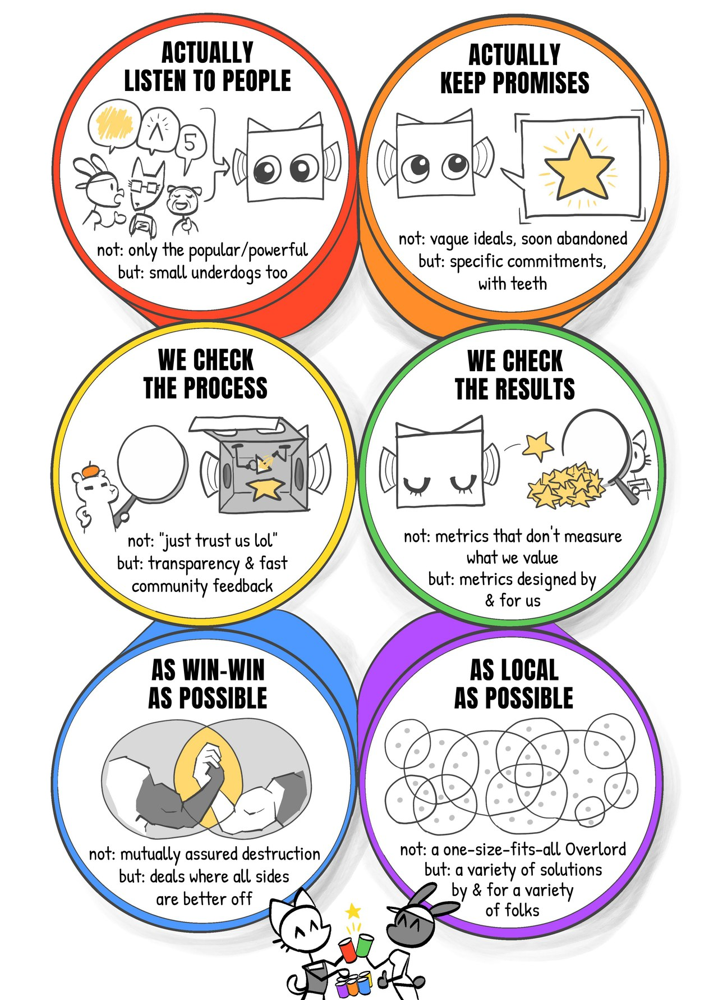

# Civic AI — 6-Pack of Care

Source for **[civic.ai](https://civic.ai/)** — the bilingual (British English/Traditional Mandarin) static site for the **6-Pack of Care**, a Civic AI governance framework by [Audrey Tang](https://afp.oxford-aiethics.ox.ac.uk/people/ambassador-audrey-tang) and [Caroline Green](https://www.oxford-aiethics.ox.ac.uk/caroline-emmer-de-albuquerque-green) at the [Oxford Institute for Ethics in AI](https://www.oxford-aiethics.ox.ac.uk/).

<p align="center">
  <a href="https://civic.ai/comics/"></a>
</p>

Civic AI is artificial intelligence that answers to the people it affects: many small, bounded local stewards — each a **Kami** — that a community can own, inspect, correct, and switch off, instead of one system built to govern everyone. The 6-Pack of Care is the governance framework — six plain-language tests for AI a community can actually trust.

- **The idea** → start with the [Manifesto](https://civic.ai/manifesto/); the six packs run [1](https://civic.ai/1/) · [2](https://civic.ai/2/) · [3](https://civic.ai/3/) · [4](https://civic.ai/4/) · [5](https://civic.ai/5/) · [6](https://civic.ai/6/), with [Measures](https://civic.ai/measures/) and the [FAQ](https://civic.ai/faq/). The full site — illustrations, audio, case studies — is **[civic.ai](https://civic.ai/)**.
- **Working in the codebase** → build, architecture, and conventions live in [AGENTS.md](AGENTS.md).
- **This README** → how the repository is laid out, and how to run and contribute to it.

## Quickstart

Requires [Bun](https://bun.sh/).

```bash
bun install     # install dependencies
bun run dev     # Astro dev server → http://127.0.0.1:4321
bun run build   # production build → dist/
```

## Scripts

| Command                       | What it does                                                                                             |
| ----------------------------- | -------------------------------------------------------------------------------------------------------- |
| `bun run dev`                 | Sync generated public assets, then start Astro with live reload at `http://127.0.0.1:4321`.              |
| `bun run build`               | Production build of the static site, minified HTML, and Pagefind index → `dist/`.                        |
| `bun run check`               | TypeScript check: `tsc --noEmit`.                                                                        |
| `bun test`                    | Focused Bun tests for the renderer, root-content loader, search corpus, and static client contracts.     |
| `bun run lint`                | Check formatting and lint (Oxfmt + Oxlint via Vite+) + `pangu-format --check` (CJK spacing).             |
| `bun run format`              | Auto-fix formatting (Oxfmt via Vite+) + `pangu-format`.                                                  |
| `bun run check-links`         | After a build, validate internal links and anchors across `dist/`.                                       |
| `bun run check:search`        | After a build, validate the search overlay, Pagefind markup, and `/tw/search-index.json`.                |
| `bun run vectorize:sync-site` | Upsert the Civic AI search corpus into the `civic-ai-site` Cloudflare Vectorize index.                   |
| `bun run worker:typecheck`    | Type-check the isolated `worker/` Cloudflare `/au` package.                                              |
| `bun run worker:test`         | Run the isolated `worker/` route, RAG, and citation tests.                                               |
| `bun run en`/`bun run tw`     | Copy the canonical English/Mandarin page set to the clipboard for translation review (macOS `pbcopy`).   |
| `bun run import-comics`       | Re-import and optimise Nicky Case's comic pages into `img/` (maintenance helper, not part of the build). |

A Vite+ **pre-commit hook** runs `vp staged` (Oxfmt + `pangu-format` + Mandarin typography checks) on staged files, and re-validates build parity when content or build files change.

Search uses Pagefind for English pages, a Fuse-backed Traditional Mandarin sidebar from `/tw/search-index.json`, and the `worker/` `/au/:question` API for streamed answers. The Worker retrieves from Cloudflare Vectorize binding `SITE_VECTORIZE` (`civic-ai-site`) and uses `AUDREY_MODEL=nemotron-ultra` with `BASETEN_API_KEY` plus optional `CF_AIG_TOKEN` to stream Nemotron Ultra through the Cloudflare AI Gateway; without those secrets it returns a deterministic excerpt/stub response for tests and local development.

## Repository layout

| Path                            | What it is                                                                                                         |
| ------------------------------- | ------------------------------------------------------------------------------------------------------------------ |
| `src/`                          | Astro source: typed root-content loader, custom Markdown renderer, layouts, components, routes, search endpoints.  |
| `_data/`                        | Global data: `site.json`, `paths.json` (reading paths), `comics.json`, glossary, Polis report, OpenClaw bootstrap. |
| `*.md` (root)                   | Canonical Markdown content, British English. Front-matter `permalink` sets the URL.                                |
| `tw-*.md`                       | Traditional Mandarin twin of each English page (served under `/tw/…`); kept in parity.                             |
| `assets/js/`                    | Source client scripts for the search overlay and `/au` answer stream, copied into generated `public/`.             |
| `img/`, `fonts/`, `audio`       | Source static assets copied through generated `public/` into the build.                                            |
| `worker/`                       | Isolated Cloudflare Worker for the `/capacity` and streaming `/au/:question` answer API.                           |
| `scripts/`                      | Content, validation, search, Vectorize, build, and migration helper scripts (see [Scripts](#scripts)).             |
| `styles.css`                    | All site styles (mobile-first; CSS custom properties).                                                             |
| `astro.config.mjs`              | Astro static build config: custom-domain root, directory URLs, `dist/` output.                                     |
| `openclaw.md`, `tw-openclaw.md` | Human OpenClaw bootstrap guides; machine-readable endpoint is generated from `_data/openclaw_bootstrap.js`.        |
| `specs/`                        | Internal design & implementation notes (unpublished).                                                              |
| `public/`                       | **Generated** Astro public directory from `scripts/sync-public.mjs` — never edit by hand (gitignored).             |
| `dist/`                         | **Generated** build output — never edit by hand (gitignored).                                                      |

## Authoring content

- Each page is a single Markdown file with YAML front matter. `permalink` sets the URL — e.g. `1.md` → `/1/`, `manifesto.md` → `/manifesto/`.
- Every English page `foo.md` has a Traditional Mandarin twin `tw-foo.md` served at `/tw/foo/`. The two link to each other through the `alt_lang_url` front-matter key — **keep them in parity** when you change either.
- Front-matter keys in use: `layout`, `title`, `meta_description`, `summary`, `lang`, `permalink`, `alt_lang_url`.
- Formatting rules (em dashes, four-space YAML, locked Mandarin terminology) are enforced by `bun run lint` and the pre-commit hook; details in [AGENTS.md](AGENTS.md).

## Contributing

Pull requests are welcome. By contributing, you agree to release your work under the [CC0 1.0 Universal](https://creativecommons.org/publicdomain/zero/1.0/) public-domain dedication ([`LICENSE`](LICENSE)).

Keep English (`*.md`) and Traditional Mandarin (`tw-*.md`) variants in parity, and reuse the project's locked Mandarin terminology rather than coining new translations.

Part of the [Accelerator Fellowship Programme](https://afp.oxford-aiethics.ox.ac.uk/), [Oxford Institute for Ethics in AI](https://www.oxford-aiethics.ox.ac.uk/).
